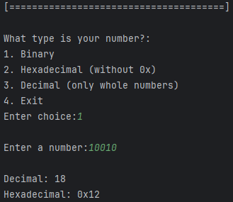

# NumConverter
> [!NOTE]
> This project was for a school assignment to practice embedded programming in C.

A command-line application that allows users to convert numbers between Binary, Decimal, and Hexadecimal formats.
## 📷 Showcase

___

## 🔧 Setup

1. Clone the repository:
    ```bash
    git clone https://github.com/Zelvios/NumConverter.git
    ```

2. Navigate to the project directory:
    ```bash
    cd NumConverter
    ```

3. Compile:
    ```bash
    gcc -o converter main.c
    ```


## Features

- Convert Decimal to Binary and Hexadecimal.
- Convert Binary to Decimal and Hexadecimal.
- Convert Hexadecimal to Decimal and Binary.
- Input validation for each number type.
